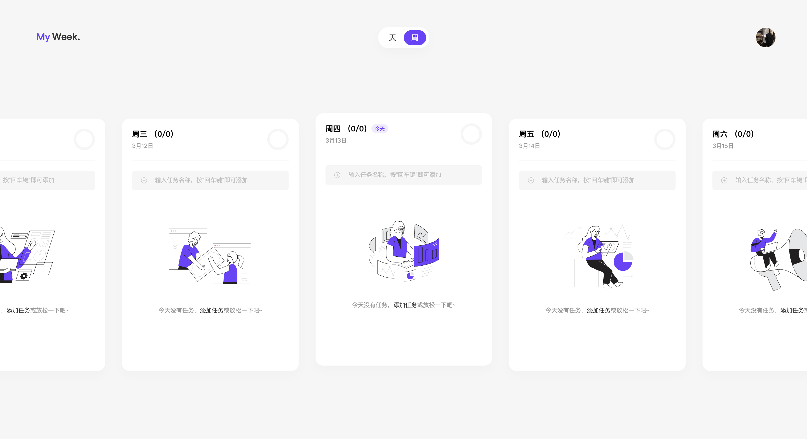

# My Week

## 简介

### My Week 是什么

是一个小小的周报工具，用于记录一周的工作和个人的目标

### 为什么要做它

解决大计划太多，却没办法落地的问题。所以把计划拆分成小任务，不谈大目标，只坚持每周的任务。积少成多。

### 数据存储

使用 IndexedDB 存储数据，所以不用担心你的数据会被泄露。而且也没有做后端的打算，一切本着简单出发。

## 技术栈

- React18
- React-Router6
- TypeScript
- Vite
- IndexedDB

## 预览

## 意见建议

[issues](https://github.com/qiuyulc/task-list/issues/new)